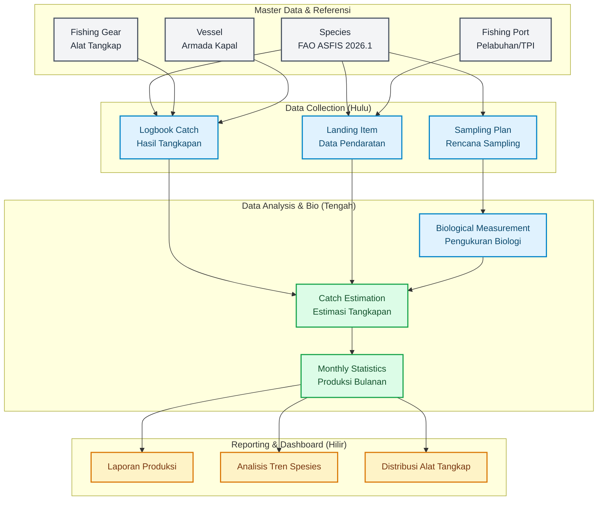

# Sistem Perikanan

Sistem Perikanan adalah aplikasi manajemen data dan statistik perikanan komprehensif yang dikembangkan dengan Laravel 13. Sistem ini mematuhi standar internasional FAO ASFIS 2026.1 untuk pendataan spesies.

## 🌊 App Flow & Arsitektur Modul

Aplikasi ini dirancang untuk mencatat seluruh siklus perikanan dari hulu (penangkapan) hingga hilir (estimasi dan pelaporan statistik).

### Penjelasan Modul:

1. **Master Data**: Pusat referensi data (Species, Gear, Vessel, Port). Spesies menggunakan standar global FAO ASFIS yang dapat di-import secara otomatis via console.
2. **Data Collection**: Pencatatan data primer di lapangan seperti Logbook (tangkapan nelayan), Data Pendaratan (di pelabuhan), dan Rencana Sampling.
3. **Analysis & Biologi**: Pengolahan data primer menjadi ukuran biologis ikan dan perhitungan estimasi tangkapan yang lebih representatif.
4. **Output & Laporan**: Agregasi data menjadi statistik bulanan dan pembuatan berbagai laporan manajerial.

## 🚀 Fitur Utama

- **Integrasi ASFIS**: Import otomatis data 13,000+ spesies dunia dengan standar ASFIS 2026.1.
- **SSO Login**: Dukungan login cepat melalui integrasi Google Workspace / Gmail (OAuth2).
- **Responsive UI/UX**: Antarmuka Tailwind CSS yang modern, mendukung dark/light mode dan mudah digunakan via perangkat mobile di lapangan.
- **Sistem Export/Import (Excel)**: Mendukung pengolahan massal (batch upload) via file `.xlsx` dan `.csv`.

## 🛠️ Instalasi & Persiapan Lingkungan

Sistem ini membutuhkan:
- **PHP** 8.4+
- **Laravel** 13+
- **MySQL** / MariaDB
- **Node.js** 22+

### Langkah-langkah:
1. Clone repositori ini.
2. Salin `.env.example` ke `.env` dan konfigurasikan koneksi database Anda.
3. Jalankan `composer install` dan `npm install`.
4. Generate app key: `php artisan key:generate`.
5. Jalankan migrasi: `php artisan migrate --seed`.
6. Import Master Data ASFIS: `php artisan asfis:import`.
7. Compile aset frontend: `npm run build`.
8. Mulai server: `php artisan serve`.

## 🤝 Lisensi

Aplikasi ini merupakan perangkat lunak hak milik tertutup (Proprietary). Hubungi Administrator Sistem untuk akses.
