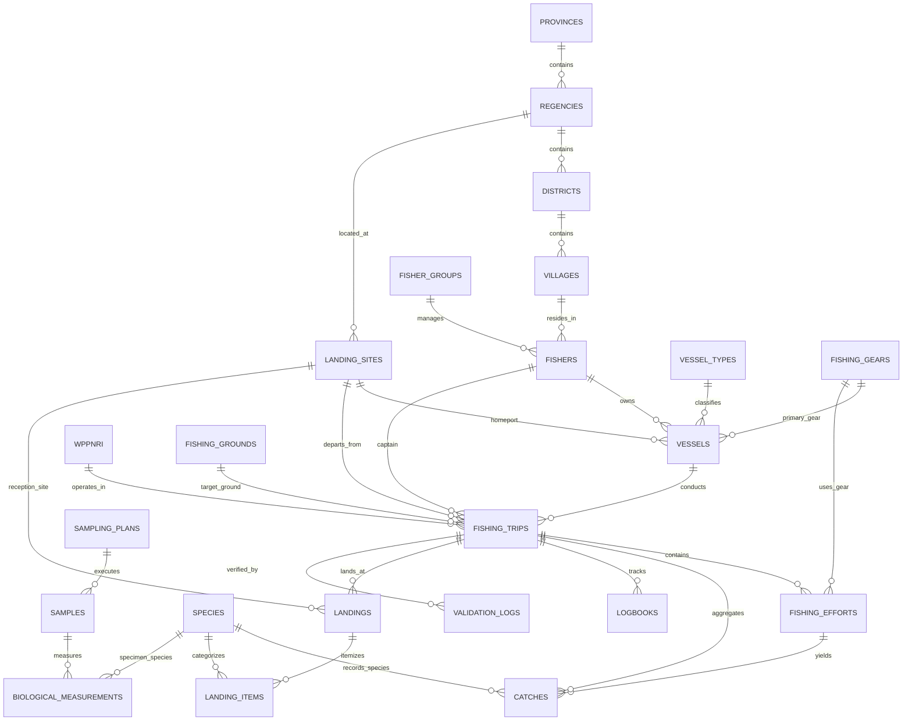

# Entity Relationship Documentation (ERD)
**Sistem Informasi & Statistik Perikanan Tangkap Provinsi Aceh**

```text
System: Sistem Informasi Perikanan Tangkap Aceh
Version: 1.0.0
Documentation Version: 1.0.0
Date: 21 September 2026
Status: Final Approved (F9 Audit Compliant)
```

---

## 1. Conceptual ERD Diagram



---

## 2. Core Operational Entities & Relationships

### A. Rantai Penangkapan (Fishing Operations Hierarchy)

| Parent Entity | Child Entity | Foreign Key | Cardinality | Delete Behavior (ON DELETE) | Keterangan |
| :--- | :--- | :--- | :---: | :--- | :--- |
| `fishers` | `vessels` | `owner_id` | $1 : N$ | `RESTRICT` | Kapal terikat pada nelayan pemilik |
| `vessels` | `fishing_trips` | `vessel_id` | $1 : N$ | `RESTRICT` | Menjaga histori pelayaran kapal |
| `fishers` | `fishing_trips` | `captain_id` | $1 : N$ | `RESTRICT` | Nahkoda yang bertanggung jawab |
| `landing_sites` | `fishing_trips` | `landing_site_id` | $1 : N$ | `RESTRICT` | Pelabuhan pangkalan/keberangkatan |
| `wppnri` | `fishing_trips` | `wppnri_id` | $1 : N$ | `RESTRICT` | Wilayah WPP operasional (571 / 572) |
| `fishing_grounds` | `fishing_trips` | `fishing_ground_id` | $1 : N$ | `RESTRICT` | Daerah penangkapan target |
| `fishing_trips` | `fishing_efforts` | `fishing_trip_id` | $1 : N$ | `RESTRICT` | Upaya penurunan alat tangkap |
| `fishing_gears` | `fishing_efforts` | `fishing_gear_id` | $1 : N$ | `RESTRICT` | Alat tangkap yang digunakan saat setting |
| `fishing_efforts` | `catches` | `fishing_effort_id` | $1 : N$ | `SET NULL` / `RESTRICT` | Tangkapan spesifik pada siklus setting |
| `fishing_trips` | `catches` | `fishing_trip_id` | $1 : N$ | `RESTRICT` | Total tangkapan agregat pelayaran |
| `species` | `catches` | `fish_species_id` | $1 : N$ | `RESTRICT` | Spesies ikan yang tertangkap |

---

### B. Rantai Pendaratan & Logbook (Landings & Logbooks)

| Parent Entity | Child Entity | Foreign Key | Cardinality | Delete Behavior (ON DELETE) | Keterangan |
| :--- | :--- | :--- | :---: | :--- | :--- |
| `fishing_trips` | `landings` | `fishing_trip_id` | $1 : N$ | `RESTRICT` | Transaksi pendaratan hasil trip |
| `landing_sites` | `landings` | `landing_site_id` | $1 : N$ | `RESTRICT` | Lokasi fisik pendaratan di pelabuhan |
| `landings` | `landing_items` | `landing_id` | $1 : N$ | `CASCADE` | Rincian komoditas dan berat ikan didaratkan |
| `species` | `landing_items` | `species_id` | $1 : N$ | `RESTRICT` | Spesies ikan didaratkan |
| `fishing_trips` | `logbooks` | `fishing_trip_id` | $1 : N$ | `CASCADE` | Catatan buku harian harian trip |

---

### C. Analisis Biologi & Sampling (Biological Sampling)

| Parent Entity | Child Entity | Foreign Key | Cardinality | Delete Behavior (ON DELETE) | Keterangan |
| :--- | :--- | :--- | :---: | :--- | :--- |
| `sampling_plans` | `samples` | `sampling_plan_id` | $1 : N$ | `CASCADE` | Sampel spesimen dari rencana sampling |
| `landing_sites` | `samples` | `landing_site_id` | $1 : N$ | `RESTRICT` | Lokasi sampling di pelabuhan |
| `samples` | `biological_measurements` | `sample_id` | $1 : N$ | `CASCADE` | Pengukuran morfometrik spesimen ikan |
| `species` | `biological_measurements` | `species_id` | $1 : N$ | `RESTRICT` | Taksonomi ikan yang diukur |

---

### D. Wilayah & Referensi Internasional (Administrative & Standards)

| Parent Entity | Child Entity | Foreign Key | Cardinality | Delete Behavior (ON DELETE) | Keterangan |
| :--- | :--- | :--- | :---: | :--- | :--- |
| `provinces` | `regencies` | `province_id` | $1 : N$ | `CASCADE` | Hierarki Wilayah (Provinsi Aceh) |
| `regencies` | `districts` | `regency_id` | $1 : N$ | `CASCADE` | Kabupaten/Kota $\rightarrow$ Kecamatan |
| `districts` | `villages` | `district_id` | $1 : N$ | `CASCADE` | Kecamatan $\rightarrow$ Gampong/Desa |
| `fao_asfis_species` | `species` | `fao_asfis_species_id` | $1 : N$ | `SET NULL` | Relasi ke taksonomi resmi FAO ASFIS |
| `fao_isscfg_gears` | `fishing_gears` | `fao_isscfg_gear_id` | $1 : N$ | `SET NULL` | Relasi ke kode alat tangkap FAO ISSCFG |
| `wppnri` | `fishing_grounds` | `wppnri_id` | $1 : N$ | `RESTRICT` | Wilayah pengelolaan perikanan |
